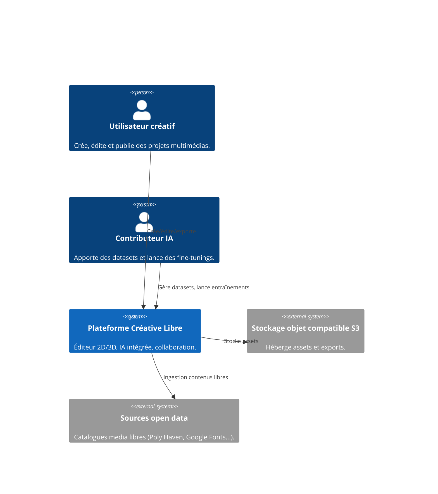
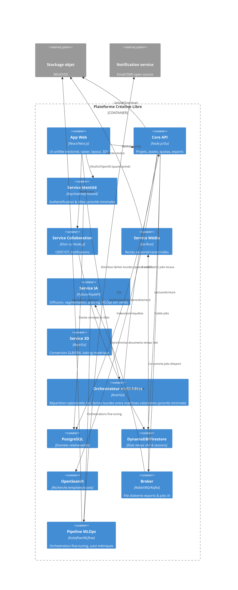

# Architecture haute-niveau (C4)

> Objectif : donner une vue rapide des composants majeurs et de leurs interactions pour le MVP étendu.
>
> **Décision 2025-10-03** : les services IA/MLOps restent inactifs tant que le projet ne dispose pas de ressources GPU adaptées ou d'un réseau décentralisé ≥500 volontaires.
>
> **Principe local-first** : privilégier l'exécution sur la machine hôte (CPU multi-coeurs, GPU local). Le serveur central ne doit servir qu'au partage d'assets et à la coordination minimale.

## Diagramme contexte (C1)

## Diagramme conteneurs (C2)

## Flux critiques
1. **Création projet** : App Web → Core API (création projet) → DB + Storage (initialisation asset).
2. **Export social sans API** : App Web génère kit d’export → Stockage objet → Notification service déclenche rappel manuel.
3. **Fine-tuning IA** *(en pause)* : Contributeur configure dataset → App Web → Service IA → Pipeline MLOps → GPU → retour métriques + modèle versionné.
4. **Édition 3D** : App Web (module three.js/WebGPU) → Service 3D pour baking/export → Stockage.
5. **Répartition locale optionnelle** *(priorité minimale)* : App Web → Orchestrateur multi-hôtes → Agents volontaires (GPU/CPU) → retour résultats → Core API.

## Gouvernance et observabilité
- Logging centralisé (ELK/OTEL), traces distribuées entre Core API, Media, IA.
- Feature flags pour activer progressivement 3D, orchestration multi-hôtes ou IA avancée.
- Tableaux de bord transparents sur les coûts (GPU, stockage) et la consommation locale pour la communauté.

## Prochaines étapes architecture
- Détailler les diagrammes C3/C4 pour les services Core API, Média et Collaboration.
- Produire des diagrammes de séquence pour les flux Export manuel, Collaboration temps réel et Orchestrateur multi-hôtes.
- Lister les dépendances techniques par composant (framework, runtime, stockage) dès que la pile cible est actée.

> Diagrammes C3/C4 détaillés seront ajoutés lors de la définition des modules critiques (export, IA, 3D).
